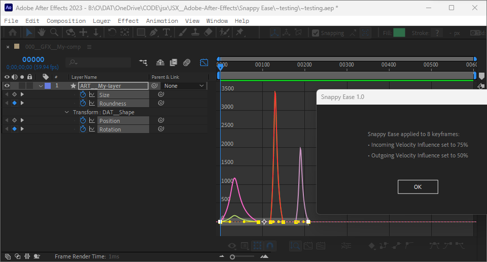
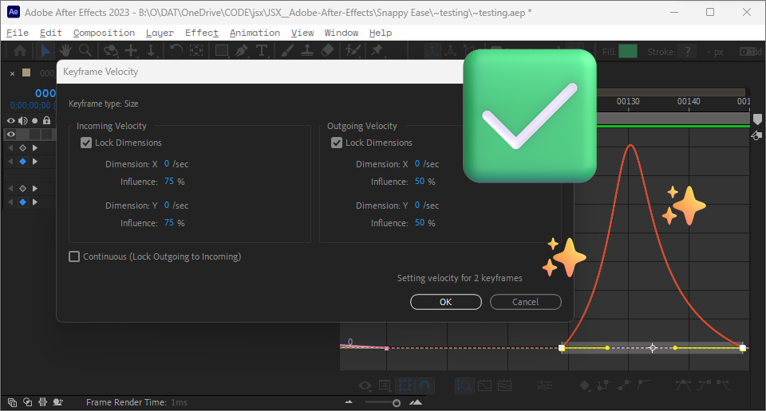

# Snappy Ease for Adobe After Effects 🏄

by Adam Eugene Kennedy

Version 1.0

- [Snappy Ease for Adobe After Effects 🏄](#snappy-ease-for-adobe-after-effects-)
  - [✨ Overview](#-overview)
  - [💎 Features](#-features)
  - [💻 How to Install](#-how-to-install)
  - [▶️ How to Run](#️-how-to-run)
  - [✅ Results](#-results)
  - [📎 Source code](#-source-code)

## ✨ Overview
Quickly apply a *snappy* easing to selected keyframes in Adobe After Effects.

## 💎 Features

- Automated ease setting for multiple keyframes.
- Custom dialog box showing the number of modified keyframes.
- Select, Run, *Snap!*
- **Mac & PC compatible.**

## 💻 How to Install

- Download the script (`.jsx`) file.
- In After Effects, navigate to **File > Scripts > Install Script File**
- Select the script file to install.
- Restart After Effects.
- The script will then appear in the **File > Scripts** menu.

## ▶️ How to Run

1. Select some keyframes in an open composition
2. Go to **File > Scripts** and run **= Snappy Ease.jsx**
3. Execute the script.
4. **Select keyframes in an active composition and run the script. You will see a confirmation dialog stating the results!**

## ✅ Results

`For all selected keyframes, in- and out-easing velocity influence will be set to 75% and 50% respectively.`

## 📎 Source code

Adam Eugene Kennedy's "After Effects Snappy Ease" on [GitHub](https://github.com/adamkennedy7/after-effects-snappy-ease).

This project is licensed under the MIT License. See the [LICENSE.txt](LICENSE.txt) file for details.